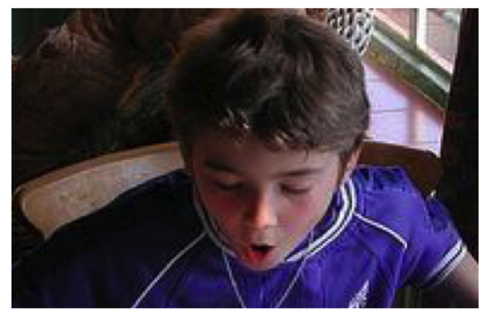
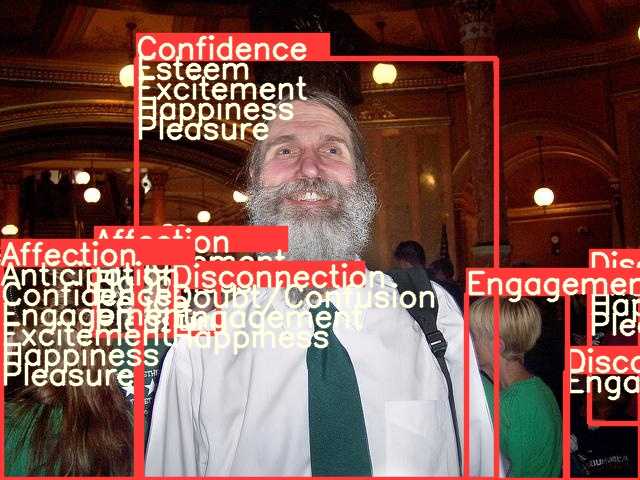
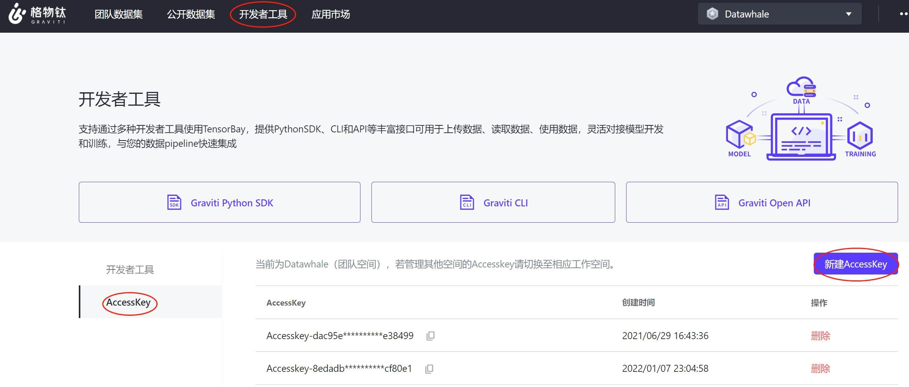
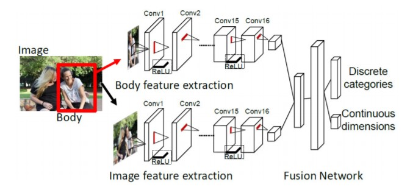

AI技术已经应用到了我们生活中的方方面面，而目标检测是其中应用最广泛的算法之一，疫情测温仪器、巡检机器人、甚至何同学的airdesk中都有目标检测算法的影子。下图就是airdesk，何同学通过目标检测算法定位手机位置，然后控制无线充电线圈移动到手机下方自动给手机充电。这看似简单的应用背后其实是复杂的理论和不断迭代的AI算法，今天笔者就教大家如何快速上手目标检测模型YOLOv5，并将其应用到情感识别中。


# 一、背景

今天的内容来源于2019年发表在T-PAMI上的一篇文章[1]，在这之前已经有大量研究者通过AI算法识别人类情感，不过本文的作者认为，人们的情感不仅与面部表情和身体动作等有关，还和当前身处的环境息息相关，比如下图的男孩应该是一个惊讶的表情：



不过加上周围环境后，刚刚我们认为的情感就与真实情感不符：


本文的主要思想就是将背景图片和目标检测模型检测出的人物信息结合起来识别情感。其中，作者将情感分为离散和连续两个维度。

| 连续情感      | 解释                                                         |
| ------------- | ------------------------------------------------------------ |
| Valence (V)   | measures how positive or pleasant an emotion is, ranging from negative to positive（高兴程度） |
| Arousal (A)   | measures the agitation level of the person, ranging from non-active / in calm to agitated / ready to act（激动程度） |
| Dominance (D) | measures the level of control a person feels of the situation, ranging from submissive / non-control to dominant / in-control（气场大小） |

| 离散情感        | 解释                                                         |
| --------------- | ------------------------------------------------------------ |
| Affection       | fond feelings; love; tenderness                              |
| Anger           | intense displeasure or rage; furious; resentful              |
| Annoyance       | bothered by something or someone; irritated; impatient; frustrated |
| Anticipation    | state of looking forward; hoping on or getting prepared for possible future events |
| Aversion        | feeling disgust, dislike, repulsion; feeling hate            |
| Confidence      | feeling of being certain; conviction that an outcome will be favorable; encouraged; proud |
| Disapproval     | feeling that something is wrong or reprehensible; contempt; hostile |
| Disconnection   | feeling not interested in the main event of the surrounding; indifferent; bored; distracted |
| Disquietment    | nervous; worried; upset; anxious; tense; pressured; alarmed  |
| Doubt/Confusion | difficulty to understand or decide; thinking about different options |
| Embarrassment   | feeling ashamed or guilty                                    |
| Engagement      | paying attention to something; absorbed into something; curious; interested |
| Esteem          | feelings of favourable opinion or judgement; respect; admiration; gratefulness |
| Excitement      | feeling enthusiasm; stimulated; energetic                    |
| Fatigue         | weariness; tiredness; sleepy                                 |
| Fear            | feeling suspicious or afraid of danger, threat, evil or pain; horror |
| Happiness       | feeling delighted; feeling enjoyment or amusement            |
| Pain            | physical suffering                                           |
| Peace           | well being and relaxed; no worry; having positive thoughts or sensations; satisfied |
| Pleasure        | feeling of delight in the senses                             |
| Sadness         | feeling unhappy, sorrow, disappointed, or discouraged        |
| Sensitivity     | feeling of being physically or emotionally wounded; feeling delicate or vulnerable |
| Suffering       | psychological or emotional pain; distressed; anguished       |
| Surprise        | sudden discovery of something unexpected                     |
| Sympathy        | state of sharing others emotions, goals or troubles; supportive; compassionate |
| Yearning        | strong desire to have something; jealous; envious; lust      |

# 二、准备工作与模型推理

## 2.1 快速入门

只需完成下面五步即可识别情感！

1. 通过克隆或者压缩包将项目下载到本地：git clone https://github.com/chenxindaaa/emotic.git

2. 将解压后的模型文件放到emotic/debug_exp/models中。（模型文件下载地址：链接：https://pan.baidu.com/s/1rBRYXpxyT_ooLCk4hmXRRA 提取码：x2rw ）

3. 新建虚拟环境（可选）：

```
conda create -n emotic python=3.7
conda activate emotic
```

4. 环境配置

```
python -m pip install -r requirement.txt
```

5. cd到emotic文件夹下，输入并执行:

```
python detect.py
```

运行完后结果会保存在emotic/runs/detect文件夹下。

## 2.2 基本原理

看到这里可能会有小伙伴问了：如果我想识别别的图片该怎么改？可以支持视频和摄像头吗？实际应用中应该怎么修改YOLOv5的代码呢？

对于前两个问题，YOLOv5已经帮我们解决，我们只需要修改detect.py中的第158行：

```python
parser.add_argument('--source', type=str, default='./testImages', help='source')  # file/folder, 0 for webcam
```

将'./testImages'改为想要识别的图像和视频的路径，也可以是文件夹的路径。对于调用摄像头，只需要将'./testImages'改为'0'，则会调用0号摄像头进行识别。

**修改YOLOv5：**

在detect.py中，最重要的代码就是下面几行：

```python
for *xyxy, conf, cls in reversed(det):
    c = int(cls)  # integer class
    if c != 0:
        continue
    pred_cat, pred_cont = inference_emotic(im0, (int(xyxy[0]), int(xyxy[1]), int(xyxy[2]), int(xyxy[3])))
    if save_img or opt.save_crop or view_img:  # Add bbox to image
        label = None if opt.hide_labels else (names[c] if opt.hide_conf else f'{names[c]} {conf:.2f}')
        plot_one_box(xyxy, im0, pred_cat=pred_cat, pred_cont=pred_cont, label=label, color=colors(c, True), line_thickness=opt.line_thickness)
        if opt.save_crop:
            save_one_box(xyxy, imc, file=save_dir / 'crops' / names[c] / f'{p.stem}.jpg', BGR=True)
```

其中det是YOLOv5识别出来的结果，例如tensor([[121.00000,   7.00000, 480.00000, 305.00000,   0.67680,   0.00000], [278.00000, 166.00000, 318.00000, 305.00000,   0.66222,  27.00000]])就是识别出了两个物体。

xyxy是物体检测框的坐标，对于上面的例子的第一个物体，xyxy = [121.00000,   7.00000, 480.00000, 305.00000]对应坐标(121, 7)和(480, 305)，两个点可以确定一个矩形也就是检测框。conf是该物体的置信度，第一个物体置信度为0.67680。cls则是该物体对应的类别，这里0对应的是“人”，因为我们只识别人的情感，所以cls不是0就可以跳过该过程。这里我用了YOLOv5官方给的推理模型，其中包含很多类别，大家也可以自己训练一个只有“人”这一类别的模型，详细过程可以参考:

[使用YOLOv5模型进行目标检测！]: https://mp.weixin.qq.com/s/JgoaLeYTAhDUnQ-ZLEvxow
[用YOLOv5模型识别出表情！]: https://mp.weixin.qq.com/s/LdCuXL49P2JhDoz9iY8wqA

在识别出物体坐标后输入emotic模型就可以得到对应的情感，即

```python
pred_cat, pred_cont = inference_emotic(im0, (int(xyxy[0]), int(xyxy[1]), int(xyxy[2]), int(xyxy[3])))
```

这里我将原来的图片可视化做了些改变，将emotic的结果打印到图片上：

```python
def plot_one_box(x, im, pred_cat, pred_cont, color=(128, 128, 128), label=None, line_thickness=3):
    # Plots one bounding box on image 'im' using OpenCV
    assert im.data.contiguous, 'Image not contiguous. Apply np.ascontiguousarray(im) to plot_on_box() input image.'
    tl = line_thickness or round(0.002 * (im.shape[0] + im.shape[1]) / 2) + 1  # line/font thickness
    c1, c2 = (int(x[0]), int(x[1])), (int(x[2]), int(x[3]))
    cv2.rectangle(im, c1, c2, color, thickness=tl, lineType=cv2.LINE_AA)
    if label:
        tf = max(tl - 1, 1)  # font thickness
        t_size = cv2.getTextSize(label, 0, fontScale=tl / 3, thickness=tf)[0]
        c2 = c1[0] + t_size[0], c1[1] - t_size[1] - 3
        cv2.rectangle(im, c1, c2, color, -1, cv2.LINE_AA)  # filled
        #cv2.putText(im, label, (c1[0], c1[1] - 2), 0, tl / 3, [225, 255, 255], thickness=tf, lineType=cv2.LINE_AA)
        for id, text in enumerate(pred_cat):
            cv2.putText(im, text, (c1[0], c1[1] + id*20), 0, tl / 3, [225, 255, 255], thickness=tf, lineType=cv2.LINE_AA)
```

运行结果：



完成了上面的步骤，我们就可以开始整活了。众所周知，特朗普以其独特的演讲魅力征服了许多选民，下面我们就看看AI眼中的特朗普是怎么演讲的：


可以看出自信是让人信服的必备条件之一。

# 三、模型训练

## 3.1 数据预处理

首先通过格物钛进行数据预处理，在处理数据之前需要先找到自己的accessKey(开发者工具$\rightarrow$AccessKey$\rightarrow$新建AccessKey)：



我们可以在不下载数据集的情况下，通过格物钛进行预处理，并将结果保存在本地（下面的代码不在项目中，需要自己创建一个py文件运行，记得填入AccessKey）：

```python
from tensorbay import GAS
from tensorbay.dataset import Dataset
import numpy as np
from PIL import Image
import cv2
from tqdm import tqdm
import os

def cat_to_one_hot(y_cat):
    cat2ind = {'Affection': 0, 'Anger': 1, 'Annoyance': 2, 'Anticipation': 3, 'Aversion': 4,
               'Confidence': 5, 'Disapproval': 6, 'Disconnection': 7, 'Disquietment': 8,
               'Doubt/Confusion': 9, 'Embarrassment': 10, 'Engagement': 11, 'Esteem': 12,
               'Excitement': 13, 'Fatigue': 14, 'Fear': 15, 'Happiness': 16, 'Pain': 17,
               'Peace': 18, 'Pleasure': 19, 'Sadness': 20, 'Sensitivity': 21, 'Suffering': 22,
               'Surprise': 23, 'Sympathy': 24, 'Yearning': 25}
    one_hot_cat = np.zeros(26)
    for em in y_cat:
        one_hot_cat[cat2ind[em]] = 1
    return one_hot_cat

gas = GAS('填入你的AccessKey')
dataset = Dataset("Emotic", gas)
segments = dataset.keys()
save_dir = './data/emotic_pre'
if not os.path.exists(save_dir):
    os.makedirs(save_dir)
for seg in ['test', 'val', 'train']:
    segment = dataset[seg]
    context_arr, body_arr, cat_arr, cont_arr = [], [], [], []
    for data in tqdm(segment):
        with data.open() as fp:
            context = np.asarray(Image.open(fp))
        if len(context.shape) == 2:
            context = cv2.cvtColor(context, cv2.COLOR_GRAY2RGB)
        context_cv = cv2.resize(context, (224, 224))
        for label_box2d in data.label.box2d:
            xmin = label_box2d.xmin
            ymin = label_box2d.ymin
            xmax = label_box2d.xmax
            ymax = label_box2d.ymax
            body = context[ymin:ymax, xmin:xmax]
            body_cv = cv2.resize(body, (128, 128))
            context_arr.append(context_cv)
            body_arr.append(body_cv)
            cont_arr.append(np.array([int(label_box2d.attributes['valence']), int(label_box2d.attributes['arousal']), int(label_box2d.attributes['dominance'])]))
            cat_arr.append(np.array(cat_to_one_hot(label_box2d.attributes['categories'])))
    context_arr = np.array(context_arr)
    body_arr = np.array(body_arr)
    cat_arr = np.array(cat_arr)
    cont_arr = np.array(cont_arr)
    np.save(os.path.join(save_dir, '%s_context_arr.npy' % (seg)), context_arr)
    np.save(os.path.join(save_dir, '%s_body_arr.npy' % (seg)), body_arr)
    np.save(os.path.join(save_dir, '%s_cat_arr.npy' % (seg)), cat_arr)
    np.save(os.path.join(save_dir, '%s_cont_arr.npy' % (seg)), cont_arr)
```

等程序运行完成后可以看到多了一个文件夹emotic_pre，里面有一些npy文件则代表数据预处理成功。

## 3.2 模型训练

打开main.py文件，35行开始是模型的训练参数，运行该文件即可开始训练。

# 四、Emotic模型详解

## 4.1 模型结构



该模型的思想非常简单，流程图中的上下两个网络其实就是两个resnet18，上面的网络负责提取人体特征，输入为$128 \times 128$的彩色图片，输出是512个$1 \times 1$的特征图。下面的网络负责提取图像背景特征，预训练模型用的是场景分类模型places365，输入是$224\times 224$的彩色图片，输出同样是是512个$1\times 1$的特征图。然后将两个输出flatten后拼接成一个1024的向量，经过两层全连接层后输出一个26维的向量和一个3维的向量，26维向量处理26个离散感情的分类任务，3维向量则是3个连续情感的回归任务。

```python
import torch 
import torch.nn as nn 

class Emotic(nn.Module):
  ''' Emotic Model'''
  def __init__(self, num_context_features, num_body_features):
    super(Emotic,self).__init__()
    self.num_context_features = num_context_features
    self.num_body_features = num_body_features
    self.fc1 = nn.Linear((self.num_context_features + num_body_features), 256)
    self.bn1 = nn.BatchNorm1d(256)
    self.d1 = nn.Dropout(p=0.5)
    self.fc_cat = nn.Linear(256, 26)
    self.fc_cont = nn.Linear(256, 3)
    self.relu = nn.ReLU()

    
  def forward(self, x_context, x_body):
    context_features = x_context.view(-1, self.num_context_features)
    body_features = x_body.view(-1, self.num_body_features)
    fuse_features = torch.cat((context_features, body_features), 1)
    fuse_out = self.fc1(fuse_features)
    fuse_out = self.bn1(fuse_out)
    fuse_out = self.relu(fuse_out)
    fuse_out = self.d1(fuse_out)    
    cat_out = self.fc_cat(fuse_out)
    cont_out = self.fc_cont(fuse_out)
    return cat_out, cont_out
```

离散感情是一个多分类任务，即一个人可能同时存在多种感情，作者的处理方法是手动设定26个阈值对应26种情感，输出值大于阈值就认为该人有对应情感，阈值如下，可以看到engagement对应阈值为0，也就是说每个人每次识别都会包含这种情感：

```
>>> import numpy as np
>>> np.load('./debug_exp/results/val_thresholds.npy')
array([0.0509765 , 0.02937193, 0.03467856, 0.16765128, 0.0307672 ,
       0.13506265, 0.03581731, 0.06581657, 0.03092133, 0.04115443,
       0.02678059, 0.        , 0.04085711, 0.14374524, 0.03058549,
       0.02580678, 0.23389584, 0.13780132, 0.07401864, 0.08617007,
       0.03372583, 0.03105414, 0.029326  , 0.03418647, 0.03770866,
       0.03943525], dtype=float32)
```

## 4.2 损失函数：

对于**分类任务**，作者提供了两种损失函数，一种是普通的均方误差损失函数（即self.weight_type == 'mean'），另一种是加权平方误差损失函数（即self.weight_type == 'static‘）。其中，加权平方误差损失函数如下，26个类别对应的权重分别为[0.1435, 0.1870, 0.1692, 0.1165, 0.1949, 0.1204, 0.1728, 0.1372, 0.1620, 0.1540, 0.1987, 0.1057, 0.1482, 0.1192, 0.1590, 0.1929, 0.1158, 0.1907, 0.1345, 0.1307, 0.1665, 0.1698, 0.1797, 0.1657, 0.1520, 0.1537]。
$$
L(\hat y) = \sum^{26}_{i=1}w_i(\hat y_i - y_i)^2
$$

```python
class DiscreteLoss(nn.Module):
  ''' Class to measure loss between categorical emotion predictions and labels.'''
  def __init__(self, weight_type='mean', device=torch.device('cpu')):
    super(DiscreteLoss, self).__init__()
    self.weight_type = weight_type
    self.device = device
    if self.weight_type == 'mean':
      self.weights = torch.ones((1,26))/26.0
      self.weights = self.weights.to(self.device)
    elif self.weight_type == 'static':
      self.weights = torch.FloatTensor([0.1435, 0.1870, 0.1692, 0.1165, 0.1949, 0.1204, 0.1728, 0.1372, 0.1620,
         0.1540, 0.1987, 0.1057, 0.1482, 0.1192, 0.1590, 0.1929, 0.1158, 0.1907,
         0.1345, 0.1307, 0.1665, 0.1698, 0.1797, 0.1657, 0.1520, 0.1537]).unsqueeze(0)
      self.weights = self.weights.to(self.device)
    
  def forward(self, pred, target):
    if self.weight_type == 'dynamic':
      self.weights = self.prepare_dynamic_weights(target)
      self.weights = self.weights.to(self.device)
    loss = (((pred - target)**2) * self.weights)
    return loss.sum() 

  def prepare_dynamic_weights(self, target):
    target_stats = torch.sum(target, dim=0).float().unsqueeze(dim=0).cpu()
    weights = torch.zeros((1,26))
    weights[target_stats != 0 ] = 1.0/torch.log(target_stats[target_stats != 0].data + 1.2)
    weights[target_stats == 0] = 0.0001
    return weights
```


对于**回归任务**，作者同样提供了两种损失函数，L2损失函数：
$$
L_2(\hat y) = \sum^3_{k=1}v_k(\hat y_k - y_k)^2
$$
其中，当$|\hat y_k - y_k|<margin$(默认是1)时，$v_k=0$，否则$v_{k} = 1$。

L1损失函数：
$$
L1(\hat y) = \sum_{k=1}^3v_k\left\{
\begin{aligned}
0.5x^2,   \qquad&|x_k| <margin\\
|x_k| - 0.5,  \qquad&otherwise
\end{aligned}
\right.
$$
其中$x_k = (\hat y_k - y_k)$。

```python
class ContinuousLoss_L2(nn.Module):
  ''' Class to measure loss between continuous emotion dimension predictions and labels. Using l2 loss as base. '''
  def __init__(self, margin=1):
    super(ContinuousLoss_L2, self).__init__()
    self.margin = margin
  
  def forward(self, pred, target):
    labs = torch.abs(pred - target)
    loss = labs ** 2 
    loss[ (labs < self.margin) ] = 0.0
    return loss.sum()


class ContinuousLoss_SL1(nn.Module):
  ''' Class to measure loss between continuous emotion dimension predictions and labels. Using smooth l1 loss as base. '''
  def __init__(self, margin=1):
    super(ContinuousLoss_SL1, self).__init__()
    self.margin = margin
  
  def forward(self, pred, target):
    labs = torch.abs(pred - target)
    loss = 0.5 * (labs ** 2)
    loss[ (labs > self.margin) ] = labs[ (labs > self.margin) ] - 0.5
    return loss.sum()
```

数据集链接：https://gas.graviti.cn/dataset/datawhale/Emotic

[1]Kosti R, Alvarez J M, Recasens A, et al. Context based emotion recognition using emotic dataset[J]. IEEE transactions on pattern analysis and machine intelligence, 2019, 42(11): 2755-2766.

YOLOv5项目地址：https://github.com/ultralytics/yolov5

Emotic项目地址：https://github.com/Tandon-A/emotic
